# User Flows Documentation

## Artist Flows

### 1. Artist Registration & Profile Setup
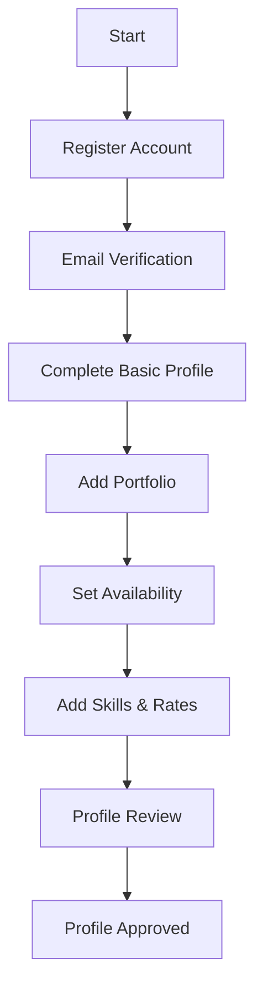

### 2. Artist Booking Flow
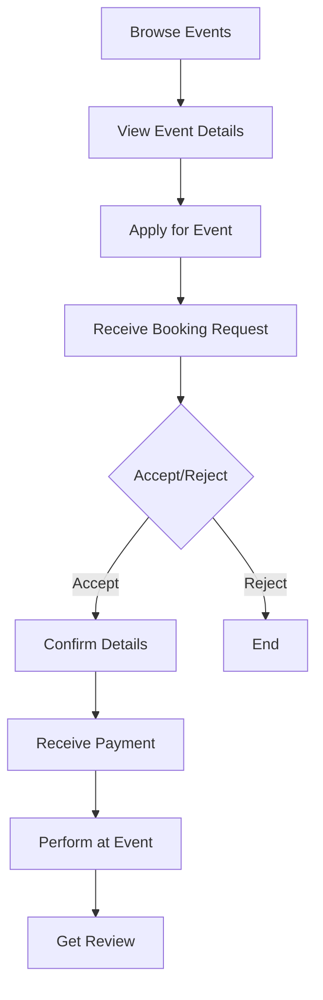

## Organizer Flows

### 1. Event Creation Flow
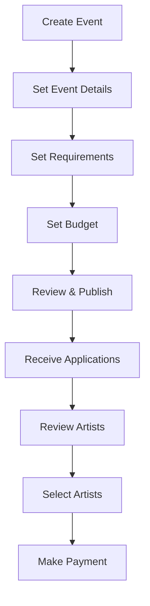

### 2. Booking Management Flow
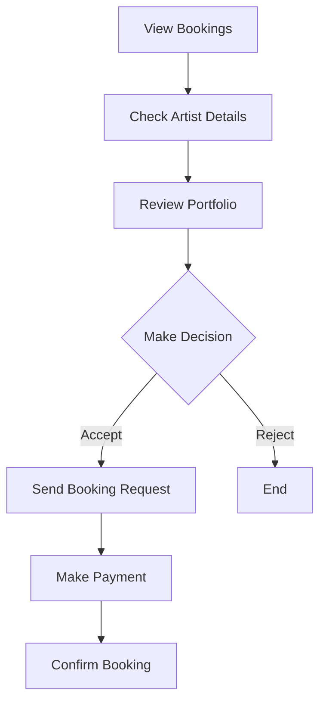

## Admin Flows

### 1. User Verification Flow
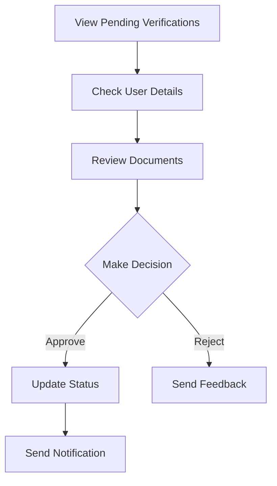

### 2. Dispute Resolution Flow
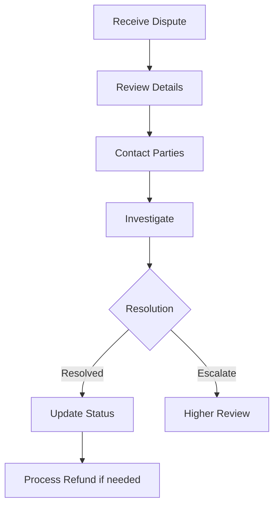

## Payment Flows

### 1. Standard Payment Flow
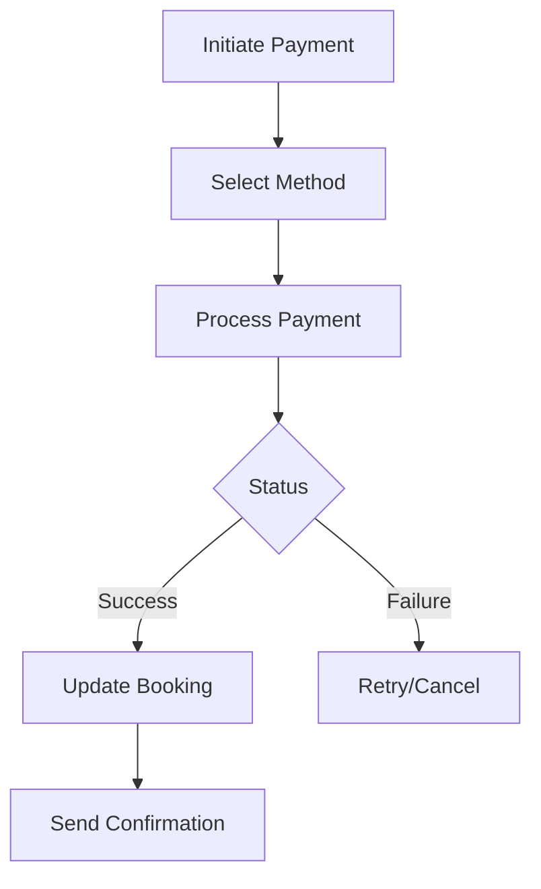

### 2. Refund Flow
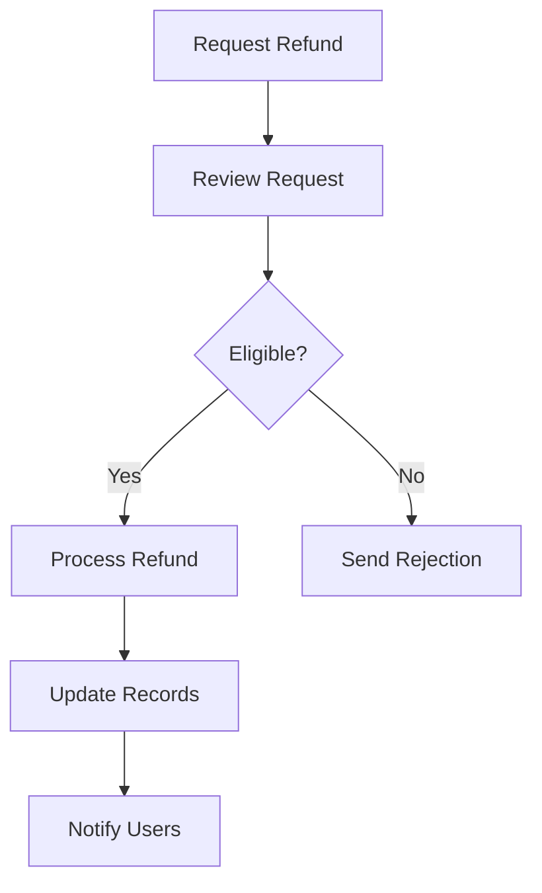

## Review System Flow

### 1. Review Submission Flow
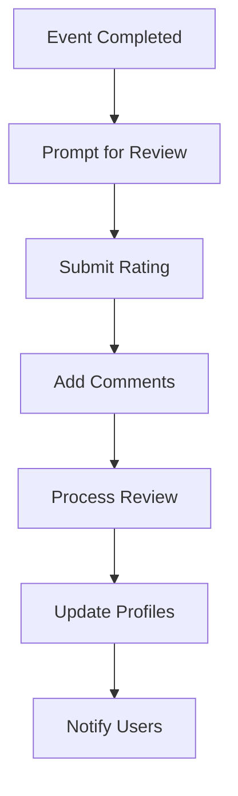

## Notification Flows

### 1. System Notifications
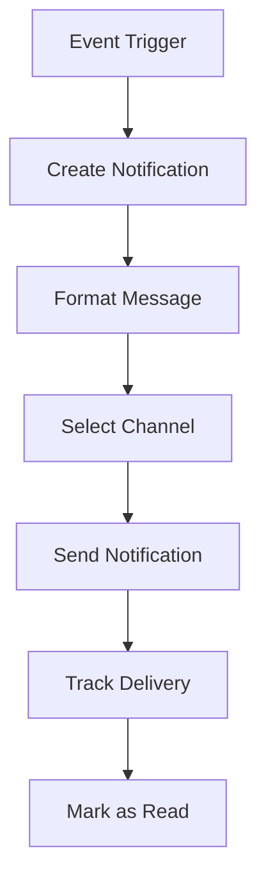

## Error Handling Flows

### 1. Error Resolution Flow
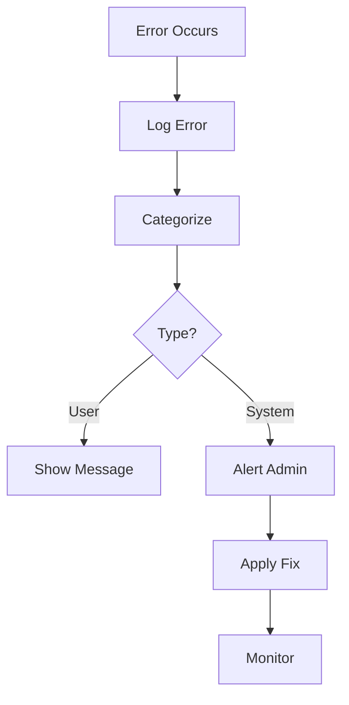